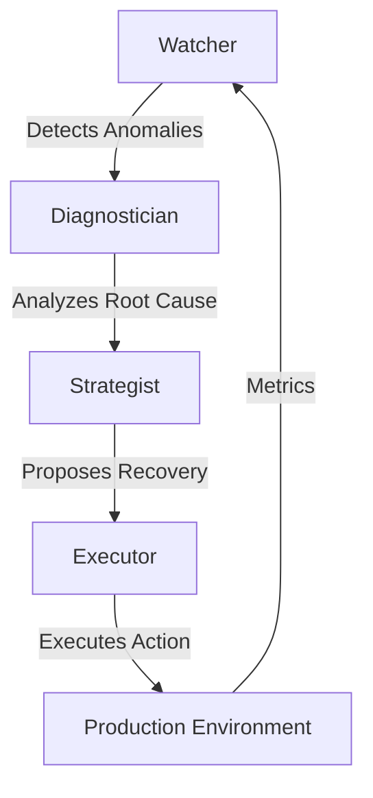

# 🛰️ Sentinel AI: Autonomous DevOps Recon
> The next generation of self-healing infrastructure.

Sentinel AI is a high-fidelity, autonomous DevOps incident response platform designed to monitor, diagnose, and remediate infrastructure failures in real-time. Built on a multi-agentic architecture, it bridges the gap between raw monitoring data and actionable recovery strategies.

---

## 🏛️ System Architecture

Sentinel AI operates through four specialized autonomous agents that collaborate to ensure maximum system uptime:



### 🤖 Core Agents
- **Watcher**: High-frequency monitoring and anomaly detection.
- **Diagnostician**: Root-cause analysis (RCA) using distributed tracing and logs.
- **Strategist**: Generates optimal remediation plans (Rollbacks, Scaling, Restarts).
- **Executor**: Permission-based deployment of recovery scripts and configuration updates.

---

## 💻 Tech Stack

- **Frontend**: Next.js 15, React, Tailwind CSS, Lucide Icons, Shadcn UI.
- **Backend**: Python 3.11, FastAPI, SQLAlchemy (SQLite), Alembic.
- **Intelligence**: LLM-driven orchestration (Groq/OpenAI/Anthropic).
- **Monitoring**: Prometheus, Grafana integration.
- **Infrastructure**: Docker & Docker Compose.

---

## ⚡ Quick Setup

### 1. Environment Configuration
Copy the template and set your API keys:
```bash
cp .env.example .env
# Edit .env with your GROQ_API_KEY and DATABASE_URL
```

### 2. Database Migration
```bash
alembic -c backend/alembic.ini upgrade head
```

### 3. Launch Services
Start the full stack with one command:
```bash
docker-compose up --build
```
Alternatively, run locally for development:
```bash
# Terminal 1: Backend
uvicorn backend.main:app --reload --port 8000

# Terminal 2: Frontend
cd frontend && npm run dev
```

---

## 📊 Dashboard Overview

The **Tactical Command Center** provides a mission-critical view of your infrastructure:
- **Live Watcher Radar**: Real-time visual feedback on anomaly scanning.
- **Incident Mission Log**: Historical and active breach tracking.
- **Injection Lab**: Execute controlled stressors (Memory leaks, CPU spikes) to test system resilience.
- **Approval Portal**: Human-in-the-loop verification for critical agent actions.

---

## 🛠️ Project Structure
- `/backend`: Core API, Agent logic, and Monitoring clients.
- `/frontend`: The Cyberpunk-themed tactical dashboard.
- `/agents`: Specialized logic for autonomous decision making.
- `/mcp_servers`: Model Context Protocol integrations.
- `/services`: Mock microservices for testing (User, Payment, API).

---
*Built with precision for the mission-critical environment.*